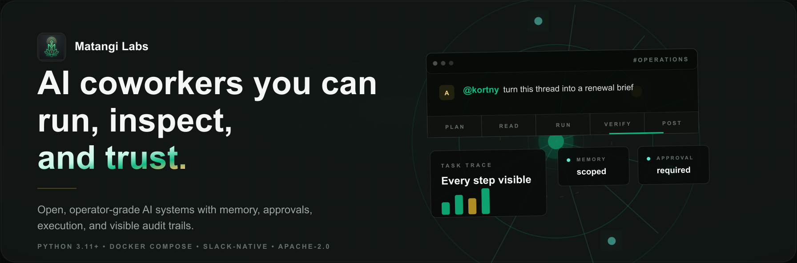
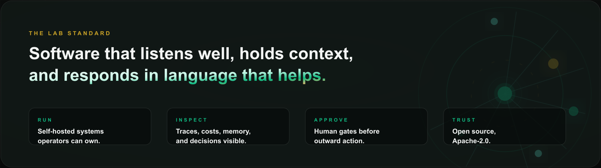
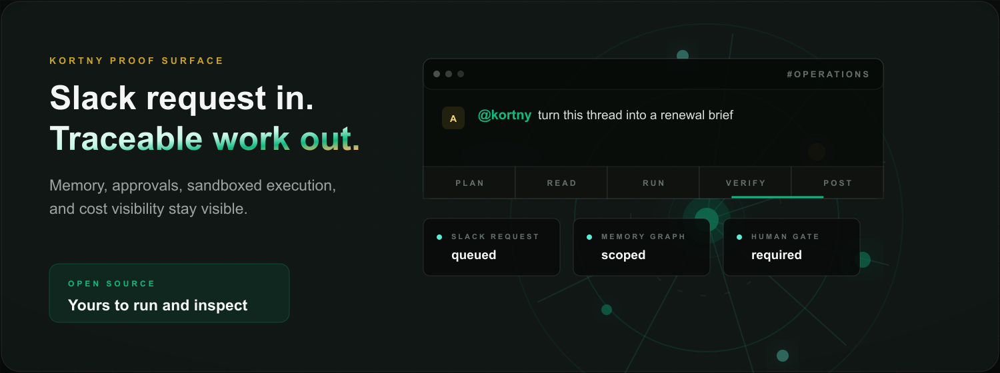

<div align="center">



[](https://matangilabs.com)
[](https://kortny.dev)
[](https://github.com/matangilabs/kortny)
[](https://github.com/matangilabs/kortny)
[](https://github.com/matangilabs/kortny/blob/main/LICENSE)

</div>

---

We build AI coworkers, not chatbots.

A chatbot answers when spoken to and forgets you the moment the tab closes. A coworker remembers what your team is working on, notices what needs doing, and acts inside the tools you already live in. That gap, judgment and memory and presence, is the whole product.

Matangi is the goddess of speech, music, knowledge, arts and learning. The name points us toward software that listens well, holds context, and responds in language that helps.



## Kortny

[**Kortny**](https://kortny.dev) is a self-hosted, Slack-native AI coworker. The code is open at [matangilabs/kortny](https://github.com/matangilabs/kortny).

Mention it in a thread and it plans, runs real work across the tools your team already uses, executes code in a sandbox, remembers how your team works, and posts the result back to the thread it came from. Underneath sit the surfaces that make it feel less like a bot and more like a colleague: workspace memory, a knowledge graph, ambient channel observation, approvals, and traceable execution.

It is open source and yours to run. Your data stays in your infrastructure, your approvals gate outward action, and you own the stack.



### How it compares

|  | **Kortny** | Hosted AI coworkers | Generic Slack bots |
|---|:---:|:---:|:---:|
| Where your data lives | **Your servers** | Vendor cloud | Vendor cloud |
| Runs on your infrastructure | ✅ | ❌ | ❌ |
| Executes real code and ships files | ✅ | sometimes | ❌ |
| Long-term memory plus knowledge graph | ✅ | varies | ❌ |
| Full audit log: every step and cost | ✅ | ❌ | partial |
| Bring-your-own LLM keys, no markup | ✅ | ❌ | ❌ |
| License | **Apache-2.0** | Proprietary | Proprietary |

### Run it in three commands

```sh
git clone https://github.com/matangilabs/kortny
cd kortny
cp .env.example .env   # add Slack and LLM keys, then:
docker compose up -d --force-recreate
```

**Runtime facts:** Python 3.11+, Docker Compose, Slack-native, Apache-2.0.
